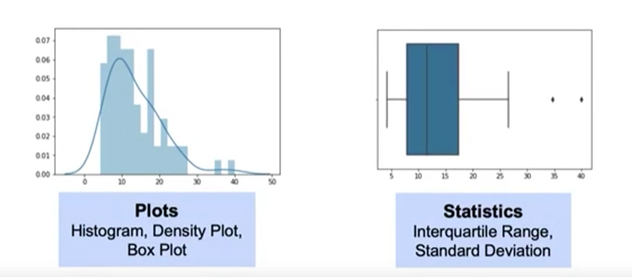

## Learning Goals
- Why data cleaning is important for Machine Learning
- Issues that arise with messy data
- How to identify duplicate or unnecessary data
- Policies for dealing with outliers

### Why is Data Cleaning is so important?
Decisions and analytics are increasingly driven by data and models.

Key aspects of Machine Learning Workflow depend on cleaned data:

- **Observations:** An instance of the data (usually a point or row in a dataset)
- **Labels:** Output variable(s) being predicted
- **Algorithms:** Computer programs that estimate models based on available data
- **Features:** Information we have for each observation (variables)
- **Model:** Hypothesized relationship between observations and data

Messy data can lead to "garbage-in, garbage-out" effect, and unreliable outcomes.

**The main data problem companies face:**
- Lack of data
- Too much data
- Bad data

Having data ready for ML and AI ensures you are ready to infuse AI across your organization.

### How can data be messy?

- Duplicate or unnecessary data
- Inconsistent text and typos
- Missing data
- Outliers
- Data sourcing issues:
    - Multiple systems
    - Different database types
    - On premises, in cloud
- ... and more.

### Duplicate or Unnecessary Data
Pay attention to **duplicate data** and research why there are multiple values.

It is a good idea to look at the features you're bringing in and **filter** the data as neccessary (be careful not to filter too much if you may use features later).

### Policies for Missing Data

- **Remove** the data: remove the row(s) entirely
- **Impute** the data: replace with subtitituted valued. Fill in the missing data with the most common value, the average value, etc.
- **Mask** the data: create a category for missing value

What are the pros and cons of each these approaches?

## Outliers
An **outlier** is an observation in data that is distant from most other observation.

Typically, these observations are aberration and donot accurately, represent the phenomenon we are trying to explain through the model

If we do not identify and deal with outliers, they can have a significant impact on the model

It is important to remember that some outliers are informative and provide insights into the data

### How to find outliers?

We can use **Plots** (histogram and a density plot) or **Box Plot** to see inter quartile range, the median, and defined min and max value for which outside of that we will have outliers. 



And we can use our residuals. We'll standardized, deleted, and studentized residuals

**Detecting Outliers: Plots**

```
import seaborn as sns

# Plot a histogram and density plot
sns.distplot(data, bins=20)

# Plot a Boxplot
sns.boxplot(data)
```

**Detecting Outliers: Statistics**
```
import numpy as np

# Calculate the interquatile range
q25, q50, q75 = np.percentile(data, [25, 50, 75])

iqr = q75 - q25

# Calculate the min / max limits to be considered an outlier
min = q25 - 1.5 * (iqr)
max = q75 + 1.5 * (iqr)

# Print values
print(min, q25, q50, q75, max)

# Identify the points
[x for x in data['Unemployment'] if x > max]
```

## Detecting Outliers: Residuals
**Residuals** (differences between actual and predicted values of the outcome variable) represent model failure.

Approaches to calculating residuals:
- **Standardized**: residual divided by standard error
- **Delete**: residual from fitting model on all data excluding current observation
- **Studentized**: delete residuals divided by residual standard error (based on all data, or all data excluding current observation).

### Policies for Outliers
- **Remove** them
- **Assign** the mean or the median value
- **Transform** the variable
- **Predict** the what the value should be:
    - Using 'similar' observation to predict likely values.
    - Using regression.
- **Keep** them, but focus on model that are resistant to outliers.