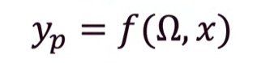
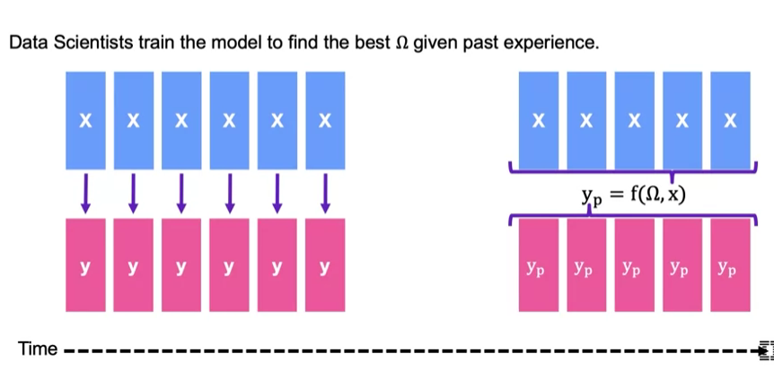
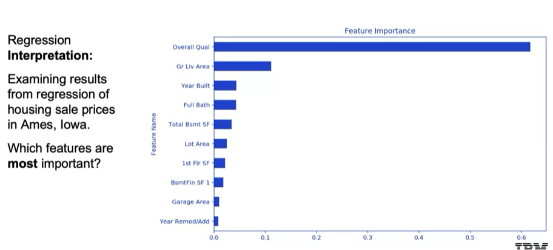
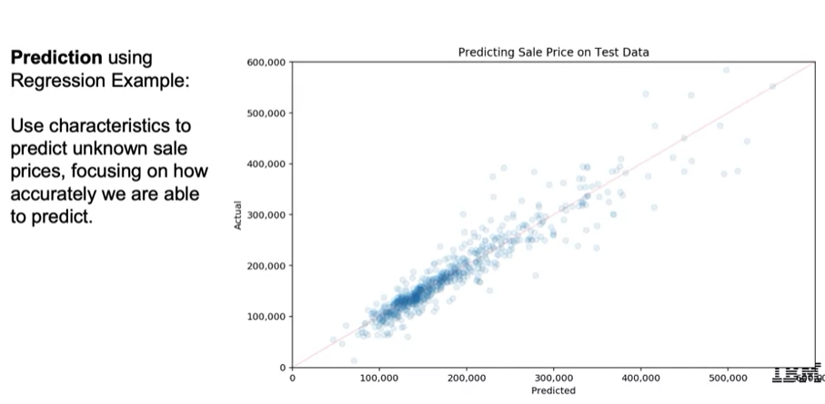
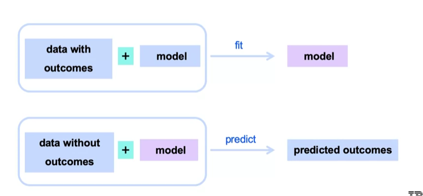

## Type of Machine Learning
### Machine Learning in our daily lives
- Spam Filtering
- Web Search
- Postal Mail Routing
- Fraud Detection
- Movie Recommendations
- Vehicle Driver Assistance
- Web Advertisements
- Social Networks
- Speech Recognition
- ...

### Fit Parameters vs Hyper Paramenter
**Machine Learning Framework** (applies to Supervised Learning Models)

Our framework estimates a relationship between the features and target
- Here, Omega (the **Fit Paramenters**) involve aspects of the model we estimate (fit) using the data.
- To implement our approach, we make decisions regarding how to produce these estimates.
- These decisions lead to the **hyperparameters**, that are an important part of the ML workflow (though not explicit components of the model).

Two main modeling approaches:
- **Regression**: y is numeric
    - e.g. stock price, box office revenue, location (x,y coordinates),...
- **Classification**: y is categorical
    - e.g. face recognition, customer churn, which word comes next,...

### Machine Learning Framework

## Supervised Learning
### Learning Goals
- Machine Learning Objectives: Interpretation and Prediction
- Examples of Machine Learning applications
- The Machine Learning Framework

### Interpretation and Prediction
**Interpretation**

- In some cases, the primary objective is to train a model to find insights from the data
- `y_p = f(omega, x)`, the **interpretation approach** use `omega` to give us insight into a system.
- Common workflow:
    - Gather x,y; Train model by finding the `omega` that gives the bes prediction `y_p = f(omega, x)`
    - Focus on `omega` (rather than `y_p`) to generate insights
- Example interpretation exercises:
    - x = customer demographics, y = sales data; examine `omega` to understand loyalty by segment
    - x = car safety features, y = traffic accidents; examine `omega` to understand what makes cars safer
    - x = market budget, y = movie revenue; examine `omega` to understand marketing effectiveness

**Prediction**
- In some cases, the primary objective is to make the best prediction
- In `y = f(omega, x)`, the **prediction approach** compares `y_p` with `y`
- The focus is on **performance metrics**, which measure the quality of the model's predictions.
    - **Performance metrics** usually involve some measure of closeness between `y_p` with `y`
    - Without focusing on interpretability, we risk having a Black-box model
- Example of prediction exercises:
    - x = customer purchase history, y = customer churn; focus on predicting customer churn
    - x = financial information, y = flagged default/non-default; focus on prediction loan default
    - x = pruchase history, y = next purchase, focus on predicting the next purchase

### Example: Regression with Housing Data
The target is the price of housing, and the features include characteristics about the house and area.

Suppose we fit the model `y = f(omega, x)`, based on data on housing sales in Ames, lowa, and obtain estimates of paramenter `omega`

These parameters represent coefficients relating the features x with expected target values.

We can interprete our results to learn about feature importance.

**Housing Data: Regression Interpretation**

**Housing Data: Regression Prediction**

### Supervised Learning Overview

