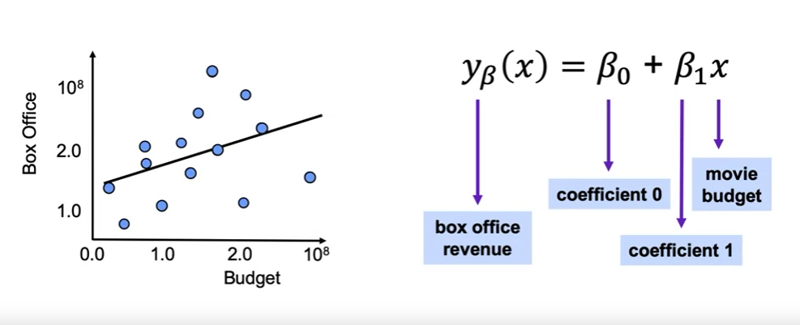

## Learning Goals
- Linear Regression
- Modeling Best Practice
- Measuring Errors

## Linear Regression



**Calculate the Residuals**

$y_\beta({x_{obs}^{(i)}}) - y_{obs}^{(i)}$

**Minimizing the Error Function**

$J(\beta_0, \beta_1) = \frac{1}{2m}\sum_{i=1}^m ((\beta_0 + \beta_1 x_{obs}^{(i)}) - y_{obs}^{(i)})^2 $

**Other Measures of Error**

**Sum of Squared Error** (SSE): $\sum_{i=1}^m (y_{\beta}(x^{(i)}) - y_{obs}^{(i)})^2$

**Total Sum of Squares** (TSS): $\sum_{i=1}^m (\bar{y_{obs}} - y_{obs}^{(i)})^2$

### Linear Regression: The Syntax
```
# Import the class containing the regression model
from sklearn.linear_model import LinearRegression

# Create an instance of the class
LR = LinearRegression()

# Fit the instance on the data
LR = LR.fit(X_train, y_train)

# Predict the expected value
y_pred = LR.predict(X_test)

```