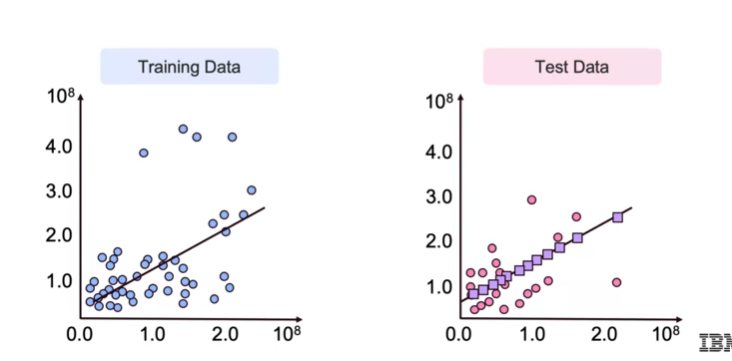

## Learning Goals
- Splitting data into training and test samples
- Cross-validation approaches
- Model complexity vs Error

### Use Training and Test Data
**Training Data**: Fit the model

**Test Data**: Measure performance:
- Predict label with model
- Compare with actual value
- Measure Error



### Fitting Training and Test Data

$Training Data + (X_{train}, y_{train})\rightarrow model(X_{train}, y_{train}).fit() \rightarrow model$

$Test Data + X_{test} \rightarrow model .predict(X_{test}) \rightarrow y_{pred}$

$Test Data + y_{test} \rightarrow Error Metric(y_{test}, y_{pred}) \rightarrow Test Error$

### Train-Test Split: The Syntax
```
# Import the train and test split function
from sklearn.model_selection import train_test_split

# Split the data and put 20% - 30% into the test set
train, test = train_test_split(data, test_size=0.3)

# Other method
from sklearn.model_selection import ShuffleSplit

```