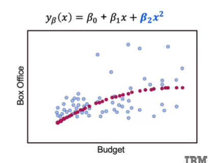
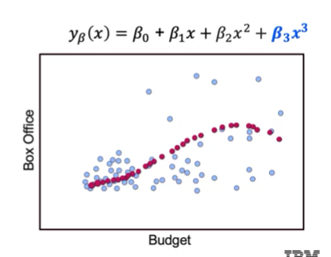

## Learning Goals
- Extending linear regression
- Using polynomial features to capture non-linear effects
- Other modes that can be used for regression and classification

## Addition of Polynomial Features





Can also include variable interactions:

$y_{\beta}(x) = \beta_0 + \beta_1 x_1 + \beta_2 x_2 + \beta_3 x_1 x_2$

### Extending the Linear Model
In addition to Polynomial features, we will also examine several additional variants of standard models, using many for both regression and classification.

Some examples include:
- Logistic Regression
- K-Nearest Neighbors
- Decision Trees
- Support Vector Machines
- Random Forests
- Ensemble Methods
- Deep Learning Approaches

### Polynomial Features: The Syntax
```
from sklearn.preprocessing import PolynomialFeatures

# Create an instance of the class
poly_feature = PolynomialFeatures(degress=2)

# Create the polynomial features and then transform the data
poly_feature = poly_feature.fit(X_data)
X_poly = poly_feature.transform(X_data)
```